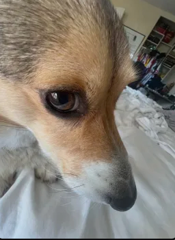

I'm James Fleming, an aspiring ML and Optmization researcher at UCSD. I'm currently doing work at the [SEE Lab](https://seelab.ucsd.edu/), [Q-Lab](https://lianhui.ucsd.edu/), and [SOC Lab](https://zhengy09.github.io/soclab.html), with more details available at my [homepage](https://james-fleming12.github.io/) or in the [Research Work Section](#research-work).

Here's a picture of my dog, and the upscaled version is [here](image.png).



## Research Work:

> "Theory is great" - Me

My research work covers a wide range of different fields, with a focus on the intersection between deeper ML theory and the application behind it. The following are the ones I'm currently focusing on being in order of lab mentioned above.

1. Energy Efficient AI and Hyperdimensional Computing
2. Reasoning Models and Language Diffusion Models
3. Non-Smooth Optimization

I've also covered these fields in the past in previous research jobs

* Computer Vision
* Mechanistic Interpretability

Here is a small code snippet from one of the projects I was working on during the winter.

```python
    for epoch in range(epochs):
        epoch_loss = torch.tensor(0.0, device=device)
        num_batches = 0
        
        dataloader.sampler.set_epoch(epoch)

        if local_rank == 0: end_time = time.perf_counter()

        for batch_idx, data in enumerate(dataloader):
            model_dtype = next(model_engine.parameters()).dtype

            output_images = data['output_images']
            if isinstance(output_images, list):
                output_images = torch.cat(output_images, dim=0)
            output_images = output_images.to(device=device, dtype=model_dtype)

            padding_latent = data.get("padding_images", None)
            if padding_latent is not None:
                padding_latent = [p.to(device=device, dtype=model_dtype) if p is not None else None for p in padding_latent]

            model_kwargs = dict(
                input_ids=data['input_ids'].to(device),
                input_img_latents=None,
                input_image_sizes=data['input_image_sizes'],
                attention_mask=data['attention_mask'].to(device),
                position_ids=data['position_ids'].to(device),
                padding_latent=padding_latent,
                past_key_values=None,
                return_past_key_values=False
            )

            loss_dict = isl_training_losses_streaming(model_engine, output_images, model_kwargs=model_kwargs)
            loss = loss_dict["loss"]

            model_engine.backward(loss)
            model_engine.step()

            epoch_loss += loss.detach()
            num_batches += 1

            del output_images, padding_latent, model_kwargs, loss_dict, loss

        torch.distributed.all_reduce(epoch_loss)
        avg_loss = (epoch_loss / num_batches / torch.distributed.get_world_size()).item()

        if local_rank == 0:
            print(f"Epoch {epoch} Loss: {avg_loss}")
            with open(log_file, 'a') as f:
                f.write(f"{epoch} {avg_loss}\n")
```

## CSE110 To-Do:
- [x] Finish Lab 1
- [ ] Start the Group Project
- [ ] Finish the Quarter